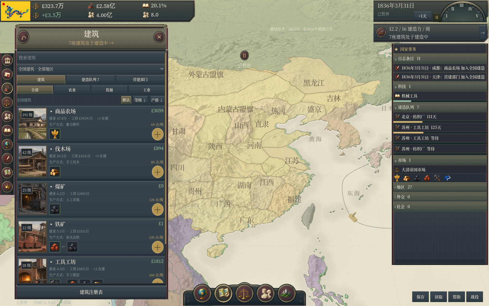
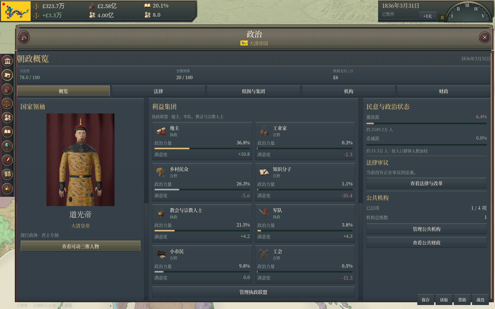
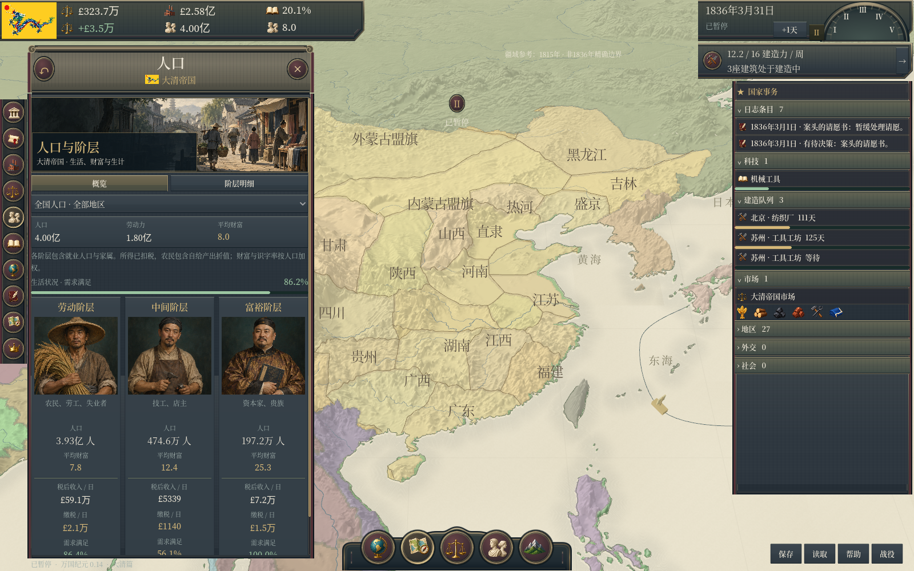
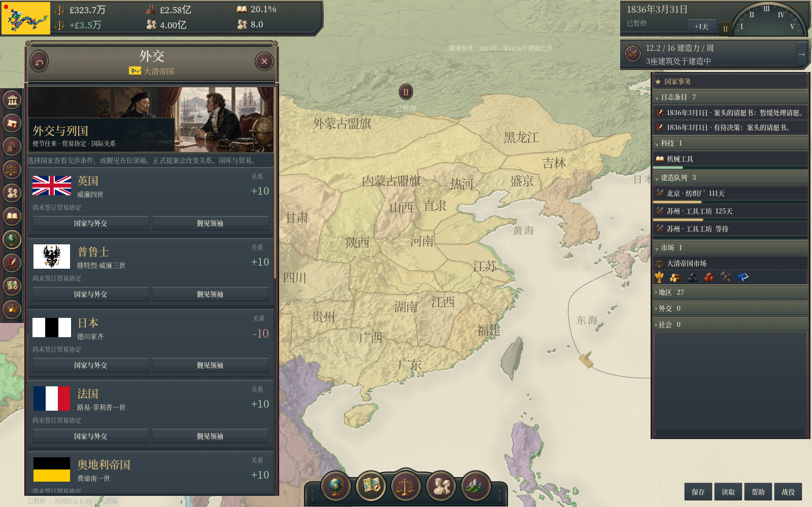

# 0.14 · 政治、人口、外交与建筑图文界面

本轮将原有的文字列表改为有明确视觉识别的经营页面，并在用户授权下实际操作本机Victoria 3，调整图片与操作区域的比例。详细观察见[界面对照记录](INTERFACE-REFERENCE-0.14.md)。

- **政治**：默认进入三栏概览，显示实时三维领袖、八个利益集团及人口加权民意；组阁页使用八个独立物件图标。法律、机构和财政继续连接现有模拟。
- **人口**：七种职业分别显示画像；增加三个汇总阶层的“概览”，可切回“阶层明细”。全国/地区筛选、收入、税额和需求均读取实际战役数据。
- **外交**：新增使节会谈插图、国旗国家卡、关系与贸易协定状态，保留国家详情和三维会谈入口。修复刷新后同名按钮可能将键盘焦点切到其他国家的问题。
- **建筑**：农场、伐木场、煤矿、铁矿、工具工坊、纺织厂、营建部门、铁路各有对应场景。全国建筑列表采用左图右操作的紧凑行，城市详情、选址、队列及地方营建保留对应图片。

新增6张原创PNG，包含三幅页面插图、八个建筑场景、八个集团符号及七职业画像和一张备用学者画像。素材使用内置imagegen生成，提示词、实际尺寸、SHA-256和裁切顺序见[资产记录](Assets/illustrations/panels/README.md)。

## 实际游戏画面

以下为Windows导出程序的Godot截图：

另有[组阁](docs/screenshots/0.14-government.png)、[人口明细](docs/screenshots/0.14-population.png)、[建筑选址](docs/screenshots/0.14-locations.png)和[营建部门](docs/screenshots/0.14-sectors.png)。检查结果及覆盖边界见[TEST-REPORT.md](TEST-REPORT.md)。

## 范围与已知不足

人物模型沿用0.13，没有把职业插画替换进历史领袖三维视图。新图片为清代风格示意，其他国家当前共用；人口插画为二维，历史领袖为可动三维。原版的政治运动、鼓动者和完整外交博弈仍未实现。

本轮没有改变经济公式、存档版本6或可玩范围，仍为12国、60地区、128城及1836—1846。界面纹理、边框、地图和人物质量与原版仍有差距。

GitHub远端此前停在0.10基线；本次PR同时同步此前保留在本地的0.11—0.13人物资源、制作脚本及验证记录。原有记录保留为独立版本，不能将旧人物验证计入本轮新增检查。源码仓库排除Windows EXE、发行ZIP和缓存。
